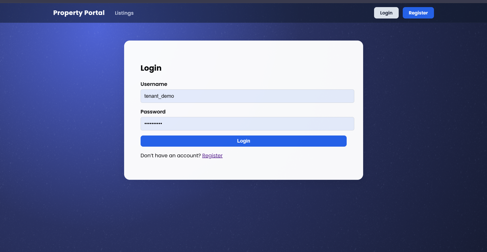
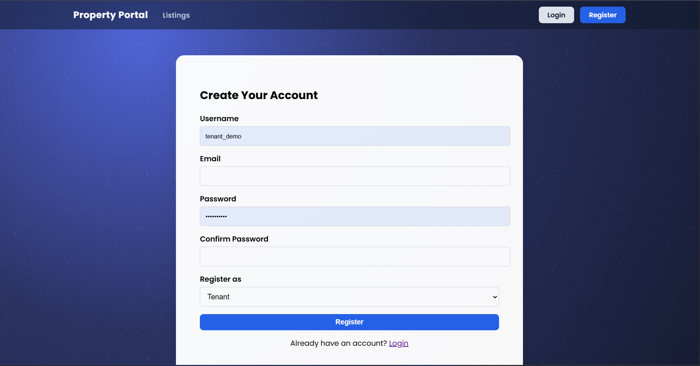
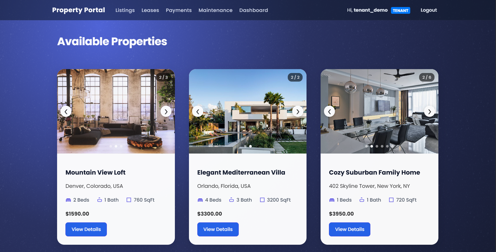
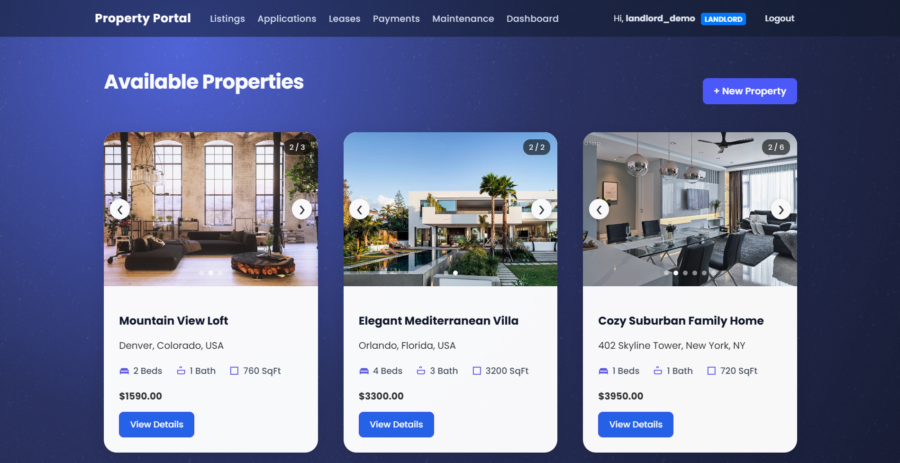
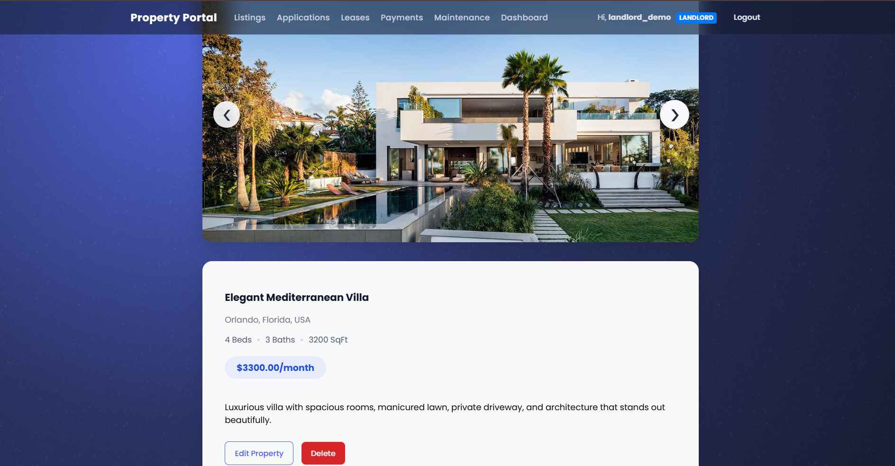
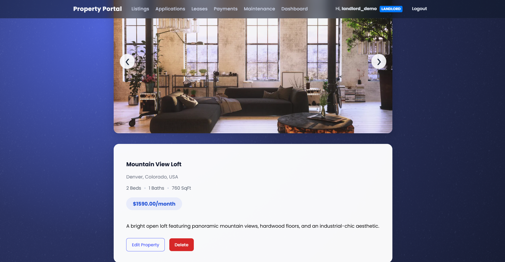
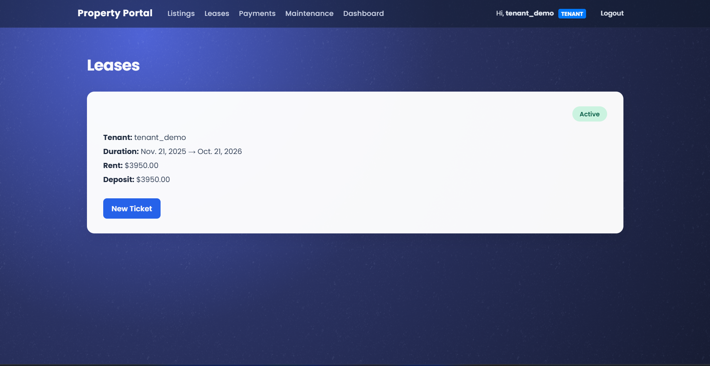
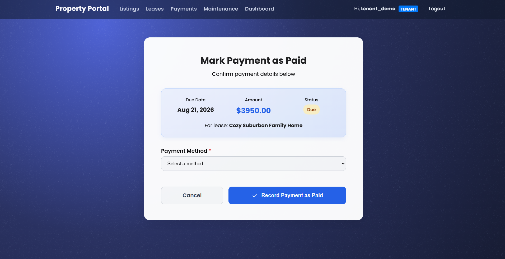
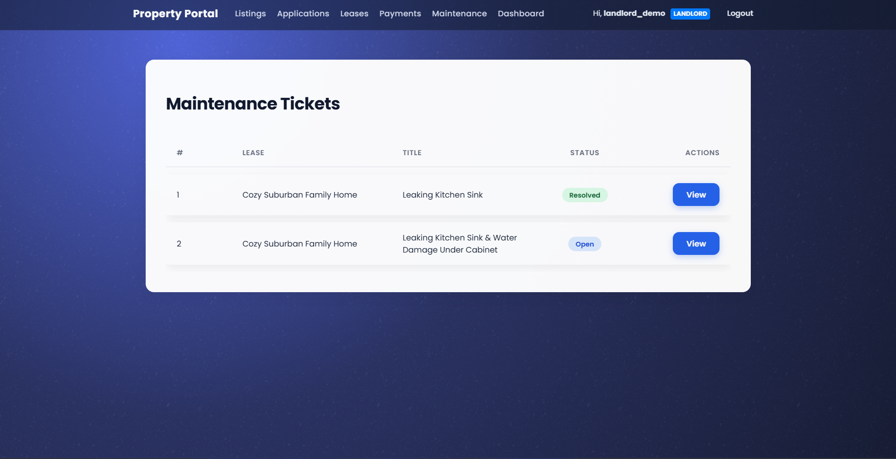

# Rental Management System

A full-stack **Django web application** for managing rental properties,
applications, leases, payments, and maintenance tickets.\
Landlords can list properties and manage tenants, while tenants can
apply, pay rent, and submit maintenance requests --- all in one secure
platform.

## Live Demo

[View the app on Render](https://rental-manager-django.onrender.com)

> You can register as a **Tenant** or **Landlord** to explore full
> functionality.\
> Use the demo accounts below for instant access.

> **Note:** The live demo runs on Render's free tier --- it may take
> **30--60 seconds** to wake up if idle OR might be completly down if DB gets expired. Will upgrade soon!!
> Please wait after opening the link.

------------------------------------------------------------------------

### Demo Login Accounts

#### Landlord Account

**Username:** `landlord_demo`\
**Password:** `Landlord123!`

#### Tenant Account

**Username:** `tenant_demo`\
**Password:** `Tenant123!`

------------------------------------------------------------------------

## Screenshots

### Login Page



### Register Page



### Home Page POV Tenant



### Home Page POV Landlord



### Property Detail Page POV Tenant



### Property Detail Page POV Landlord



### Leases



### Payments




### Submit Application


### Maintenance Ticket



### Payment History


------------------------------------------------------------------------

## Overview

This project is a **complete rental management platform** built with
Django, featuring: - Role-based access (Landlord / Tenant) - Property
CRUD with image uploads - Application & approval workflow - Automated
lease generation - Monthly payment scheduling with overdue logic -
Maintenance ticket system - Responsive dashboard analytics

Perfect for learning **Django authentication, file handling, signals,
custom decorators, role-based views, and relational data modeling**.

------------------------------------------------------------------------

## Tech Stack

-   **Backend**: Django\
-   **Frontend**: HTML, CSS, JavaScript\
-   **Database**: PostgreSQL
-   **Authentication**: Django Auth + Custom Profile Roles\
-   **File Storage**: Django Media Files\
-   **Deployment**: Render

------------------------------------------------------------------------

## Features

### 1. **Role-Based Access Control**

-   Users are assigned **Landlord** or **Tenant** role on registration
-   Custom `@role_required` decorator enforces permissions

### 2. **Property Management (Landlords)**

-   Create, edit, delete listings
-   Upload multiple property images
-   Toggle active/inactive status

### 3. **Application System**

-   Tenants submit applications with custom messages
-   Landlords review, approve, or reject
-   Auto-generates **12-month lease** on approval

### 4. **Lease & Payment Automation**

-   Payments auto-generated monthly
-   Grace period + late fee logic
-   Mark payments as paid (with method)
-   Overdue status updates

### 5. **Maintenance Tickets**

-   Tenants create tickets per lease
-   Landlords update status: Open → In Progress → Resolved

### 6. **Dashboards**

-   **Landlord Admin Dashboard**: Stats on properties, applications,
    leases, payments, tickets
-   **Tenant Dashboard**: Active lease, upcoming payments, ticket
    history

### 7. **Secure & User-Friendly**

-   Login required for all actions
-   Object-level permissions (e.g., edit only your property)
-   Flash messages for feedback

------------------------------------------------------------------------

## Project Structure

rental_project/\
├── manage.py\
├── requirements.txt\
├── README.md\
├── rentals/\
│ ├── migrations/\
│ ├── templates/\
│ ├── static/\
│ ├── models.py\
│ ├── views.py\
│ ├── forms.py\
│ ├── urls.py\
│ ├── decorators.py\
│ └── admin.py\
├── accounts/\
├── rental_project/\
│ ├── settings.py\
│ ├── urls.py\
│ └── wsgi.py\
└── media/

------------------------------------------------------------------------

## Local Setup (Development)

### 1. Clone & Enter Directory

``` bash
git clone https://github.com/yourusername/rental-management-django.git
cd rental-management-django
```

### 2. Create Virtual Environment

``` bash
python -m venv venv
source venv/bin/activate    # On Windows: venv\Scripts\activate
```

### 3. Install Dependencies

``` bash
pip install -r requirements.txt
```

### 4. Run Migrations

``` bash
python manage.py migrate
```

### 5. Create Superuser (Optional Admin)

``` bash
python manage.py createsuperuser
```

### 6. Run Server

``` bash
python manage.py runserver
```

Visit: http://localhost:8000
